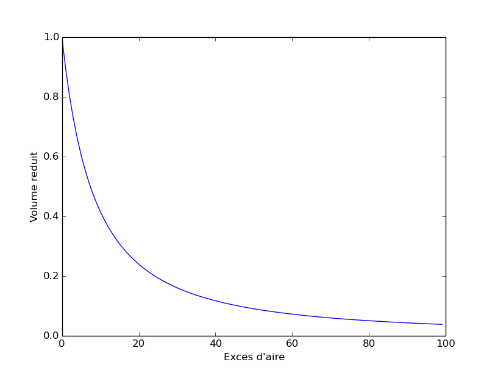

% Some Notes for Soft Matter
% Jinming LYU
% \today 

# \text{V\'{e}sicule} #

- Volume \text{r\'{e}duite}: 
  \begin{equation}
    v=\frac{\text{volume V de la V\'{e}sicule}}{\text{volume de la sph\`{e}re de surface S}}=\frac{V}{\frac{4}{3}\pi\left[\frac{S}{4\pi}\right]^{3/2}} \in [0,1]
  \end{equation}

- \text{L'exc\`{e}s d'aire}:
  \begin{equation}
    S=R^2(4\pi+\Delta),\ \ \Delta\in [0,+\infty)
  \end{equation}

- Relation between $v$ and $\Delta$ (Figure. \ref{parameters_relation}):
  \begin{equation}
    v=\left(1+\Delta/4\pi\right)^{-3/2}
  \end{equation}
  

- \text{L'incompressibilit\'{e} surfacique}:
  \begin{equation}
    \nabla_s\cdotp\mathbf{V}=0\ \ \text{en}\ \ \mathbf{x}=\mathbf{x_m}
  \end{equation}
  \text{o\`u} $\nabla_s$ est le gradient surfacique et $\mathbf{x_m}$ \text{d\'esigne} un point de la menbrane.

- [Helfrich](https://cours.espci.fr/site.php?id=29&fileid=829) bending energy:
  \begin{equation}
    F_k=\frac{\kappa}{2}\int_{S}\left(2H-C_0\right)^2dS
  \end{equation}
  whre $\kappa$ is bending modulus, $H,C$ is the mean and [spontaneous](https://tel.archives-ouvertes.fr/tel-00005981/document)($C=0$ \text{or} $1/R_0$) curvature.

- Somes adimensional numbers
    + $\kappa$: bending modulus
    + $\gamma$: la tension \text{m\'{e}canique}
    + $\eta_{i,e}$: les \text{viscosit\'es} dynamiques des fluides interne et externe
    + $R=\left(\frac{3V}{4\pi}\right)^{1/3}$ la taille \text{caract\'{e}ristique} de \text{v\'{e}sicule}
    + $\dot{\varepsilon}$[$s^{-1}$]: $\overrightarrow{V}^{\infty}=\dot{\varepsilon}(x\overrightarrow{e}_x-y\overrightarrow{e}_y)$, le taux d'\text{\'{e}longation}, ***在程序的输入文件为Gamma_dot***(Flow strength)
    + $v$ et $\Delta$
    + $\lambda=\frac{\eta_{i}}{\eta_{e}}$: le contraste de \text{viscosit\'{e}}
    + $C_a=\frac{\eta_e\dot{\varepsilon}R^3}{\kappa}$: le nombre capillaire qui mesure le rapport des forces viequeuses sur la force de flexion, 当$C_a$很小时，vesicule处于热力学平衡态。

- 特征时间定义
    + 有流动时：用le taux d'\text{\'{e}longation}或者 le taux de cisaillement $\dot{\varepsilon}$定义，$\tau=\dot{\varepsilon}^{-1}$
    + 无流动时：le seul temps \text{caract\'{e}ristique} du \text{probl\`{e}me} est **le temps visqueux**, $\tau=\frac{\eta R^3}{\kappa}$ 

# Drop #
- Some typical numbers of droplet:
    + radius $a \sim 10-100 \mu m$
    + characteristic velocity $u_0 \sim 100 \mu m\ s^{-1}$
    + density $\rho\sim 10^3 kg\ m^{-3}$
    + dynamic viscosity $\mu \sim 100\ mPa\ s$
    + Reynolds number Re $\sim\ 10^{-4}$, it can reach $10^{-2}$ for water 

- Some typical parameters
    + $\gamma$: surface tensoin
    + $\mu_s(\mu_d)$: shear (dilational) surface viscosity
    + $\lambda=\frac{\mu^i}{\mu^e}$ is the viscosity contrast
    + $\dot{\varepsilon}$ is the shear rate
    + $Ca=\frac{\mu^e \dot{\varepsilon}a}{\gamma}=\frac{\text{hydrodynamic stress}}{\text{the resistance of surface tension}}$ is the capillary (or Weber) number, where $a$ is the initial droplet radius
    + $Bq_s=\frac{\mu_s}{\mu^e a}$ and $Bq_d=\frac{\mu_d}{\mu^e a}$ are the dimensionless Boussinesq numbers, characterizing *shear* and *dilational* surface viscosity respectively. When $Bq_s=Bq_d$, this single quantity is abbreviated by the Boussinesq number $Bq$. ***A droplet with $Bq=0$ is said to be \'clean\'***.
    + $\beta=(Bq)(Ca)=\frac{\mu \dot{\varepsilon}}{\gamma}=\frac{\text{surface viscosity}}{\text{tension}}$
    + $\tau=\dot{\varepsilon}^{-1}$ is the characteristic time
    + $a$, the initial droplet radius (with initial sphere shape), is the characteristic length
    + $\mu^e \dot{\varepsilon}$ is used to undimensionalize pressure and membrane stress.
- Surface stress tensor $\overline{\mathbf{\sigma}}_s$ (Boussinesq-Scriven stress tensor)
  \begin{equation}
    \overline{\mathbf{\sigma}}_s=\gamma \overline{\mathbf{P}}+(\mu_d-\mu_s)\varTheta \overline{\mathbf{P}} + 2\mu_s \overline{\mathbf{e}}
    \label{Boussinesq_Scriven}
  \end{equation}
  where $\overline{\mathbf{P}}$ is the surface projection tensor, $\varTheta$ is the surface rate of dilation and $\overline{\mathbf{e}}$ is the surface rate of deformation rate. They are defined as
  \begin{equation}
    \overline{\mathbf{P}}=\overline{\mathbf{I}}-\mathbf{n}\mathbf{n}^T,\ \overline{\mathbf{e}}=\frac{1}{2}\overline{\mathbf{P}}(\nabla_s\mathbf{v}^s+(\nabla_s\mathbf{v}^s)^T)\overline{\mathbf{P}}\ \text{and}\ \varTheta=\overline{\mathbf{P}}\colon\nabla_s\mathbf{v}^s.
  \end{equation}
  where $\mathbf{n}$ is the unit outward normal vector.
